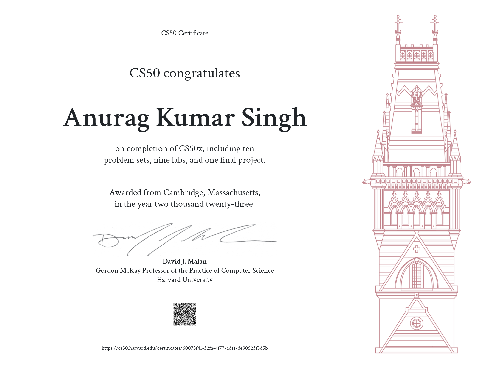
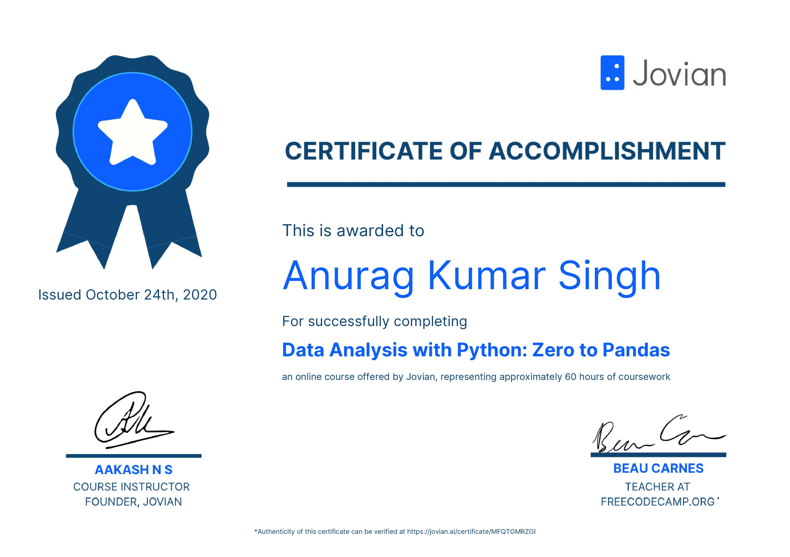
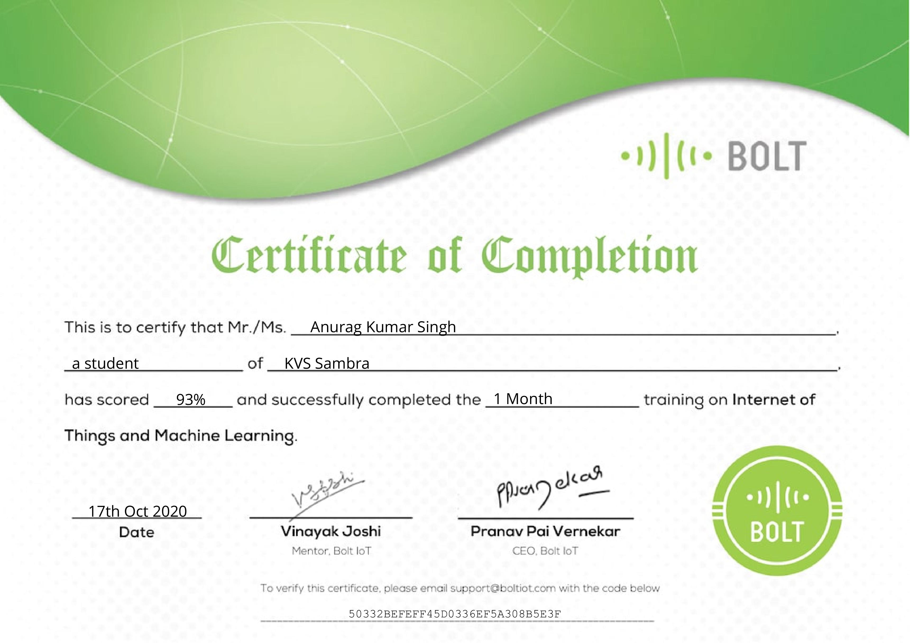
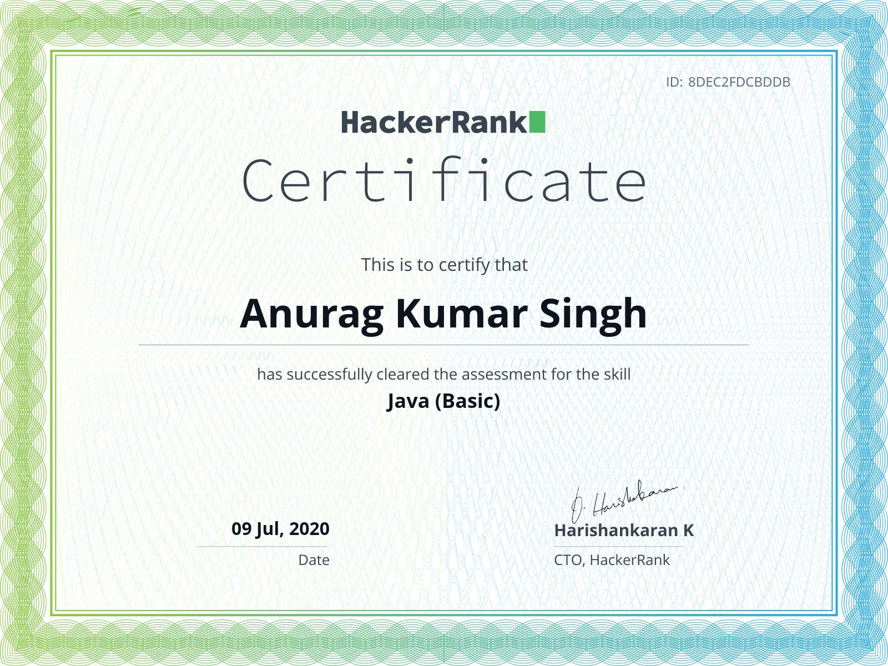
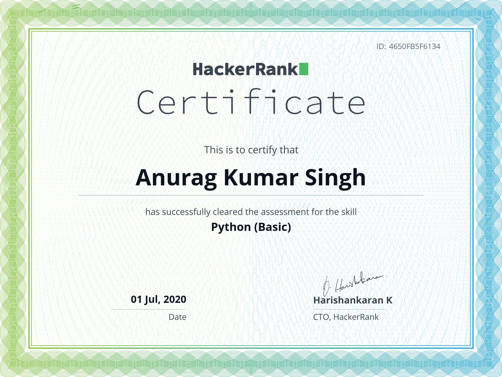
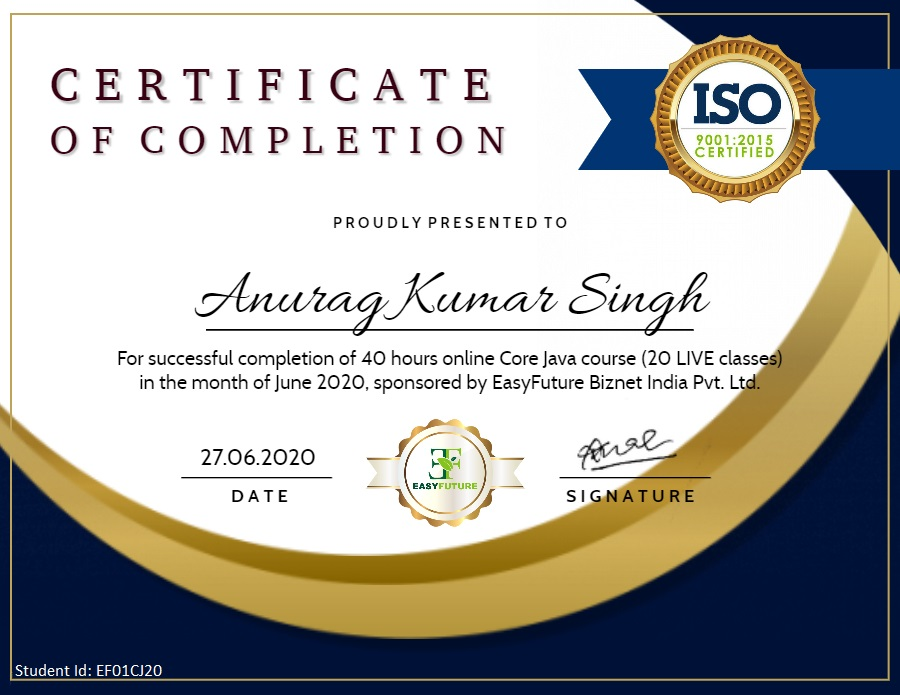

# My Work For all The Certification I have Done

### All the Certificate image is hyperlink to the verified link of the certificate. Click on the image to the link.
## Harvard University: CS50x

You can check the the work for all the 10 weeks of this program in [this folder](./CS50x)

## Deep Learning with PyTorch: Zero to GANs

You can check the Jupyter Notebook of all the assignments and Project in [this folder](./Deep_Learning) or visit my [Jovian.ai profile](https://jovian.ai/anurag3301)

## Data Analysis with Python: Zero to Pandas

You can check the Jupyter Notebook of all the assignments and Project in [this folder](./Data_Analysis) or visit my [Jovian.ai profile](https://jovian.ai/anurag3301)

## Internet of Things and Machine Learning

The project I made for this course was a Live Insta Follower counter read this [doc](./BoltIOT) or best read my post on [hackster](https://www.hackster.io/anuragkumar07102003/live-insta-following-follower-counter-7c0464)

## Java (Basic)

To get HackerRank certification you need to solve number of problems in 90 min. But there is no way to see the code we worte after the submission so I can't show the code

## Problem Solving (Basic)

To get HackerRank certification you need to solve number of problems in 90 min. But there is no way to see the code we worte after the submission so I can't show the code.

## Python (Basic)

To get HackerRank certification you need to solve number of problems in 90 min. But there is no way to see the code we worte after the submission so I can't show the code.

## Core Java

There course was live and it has live quiz, so no work to show.
